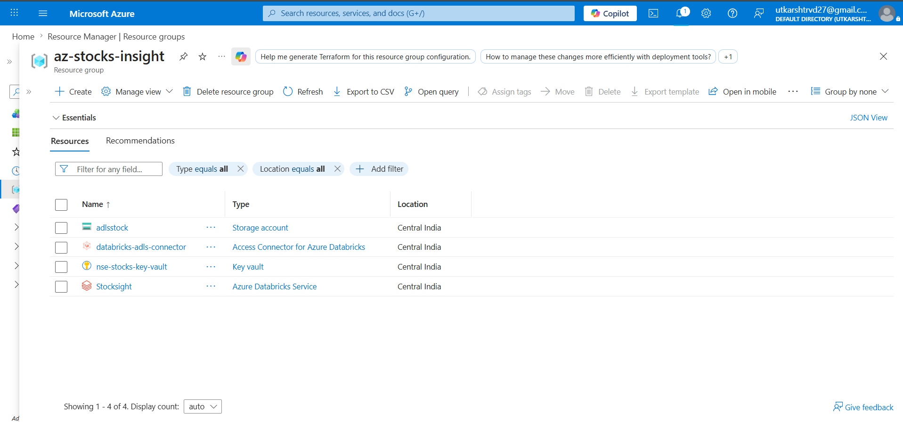
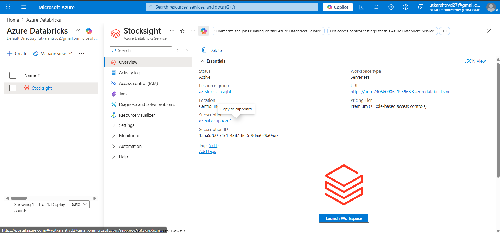
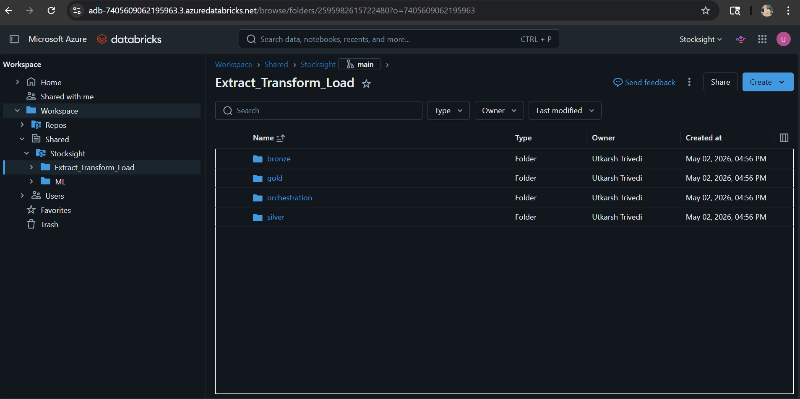
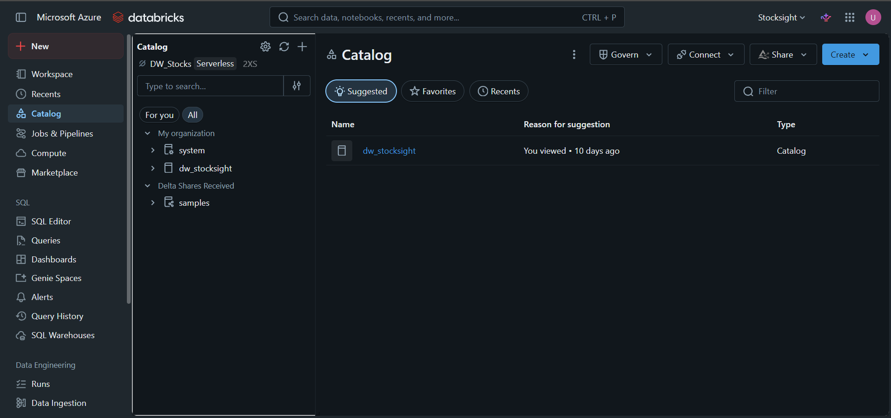
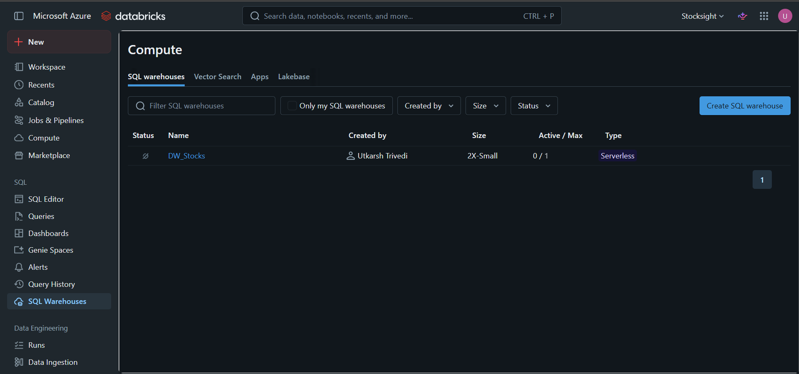
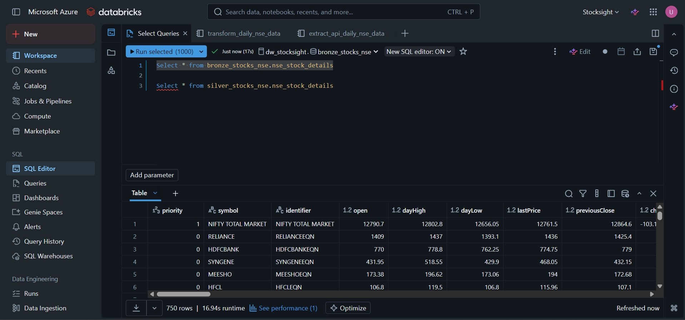
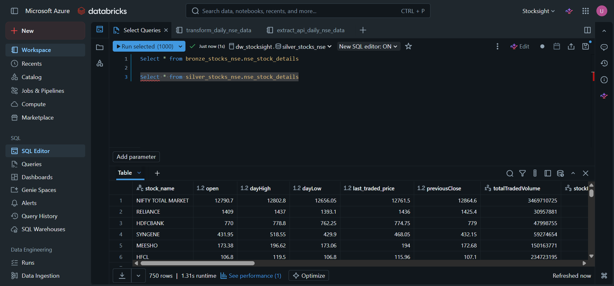

# Stocksight - Project Overview

## Medallion Architecture
```
Extract_Transform_Load/
├── bronze/
│   ├── notebooks/
│   │   └── extract_api_daily_nse_data.ipynb
│   └── configs/
│       └── bronze_config.yaml
│   
├── silver/
│   └── notebooks/
│       └── transform_daily_nse_data.ipynb
│   
├── gold/
│   └── notebooks/
│       ├── nse_aggregations.ipynb
│       └── nse_feature_engineering.ipynb
│   
└── orchestration/
    └── jobs/
        └── daily_stock_pipeline.yml

```

## Bronze Layer
This layer stores raw NSE API data in Delta format as the Bronze dataset.

#### Contents
- **notebooks/**: Databricks notebooks for data extraction
- **configs/**: Configuration files for API endpoints and storage

### Process
1. Extract raw data from NSE API using `extract_api_daily_nse_data.ipynb`
2. Normalize the nested JSON response using pandas
3. Add governance metadata (`ingestion_timestamp`, `ingestion_date`, `pipeline_run_id`, `source_system`, `file_name`)
4. Write the dataset to a Bronze Delta table in Azure Databricks

### Data Format
Raw NSE API response is flattened into a tabular schema and written as Delta to support Bronze layer querying, lineage, and auditability.

### Notes
- The notebook loads configuration from `configs/bronze_config.yaml`
- The Bronze table is registered as `bronze_stocks_nse.nse_stock_details`
- Add governance metadata (pipeline_run_id, source_system, etc.)
- Partitioning is applied by `ingestion_date` for query performance


## Silver Layer
This layer stores cleaned, validated, and governed data.

### Contents
- **notebooks/**: Databricks notebooks for validation and cleaning

### Process
1. Read raw data from Bronze layer
2. Clean data (removing unnecessary columns, renaming columns)
3. Write to Delta tables with partitioning

### Data Quality Rules
- Required columns present
- Data type consistency


## Gold Layer
This layer stores business-ready aggregations and ML features.

### Contents
- **notebooks/**: Databricks notebooks for aggregations and feature engineering

### Process
1. Read cleaned data from Silver layer
2. Create business aggregations (daily summaries, technical indicators)
3. Generate ML features (normalized prices, volatility measures)
4. Store as Delta tables and SQL views

### Outputs
- **Technical Indicators**: SMA, volatility, price changes
- **ML Features**: Normalized and engineered features for modeling


## Screenshots
### 1. Resource Group (az-stocks-insight)


### 2. Azure Databricks Service (Stocksight)


Databricks Workspace:


Databricks Catalog:


Databricks SQL Warehouse:


Bronze Layer:


Silver Layer:

